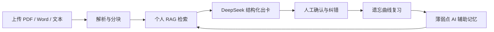

# 药考速记

> 面向执业药师备考的 AI 资料出卡、个人 RAG 知识库与自适应复习作品集。

这是一个移动端优先的全栈 AI 产品 Demo。它把用户上传的 PDF、Word 或文本拆成可追溯的资料片段，通过 DeepSeek 生成结构化药考卡片，再结合复习结果形成薄弱点诊断和下一次复习排期。

当前仓库定位为**个人面试作品**，重点展示产品判断、AI 工程、RAG 数据链路、全栈实现和移动端交付能力，不按商业生产系统承诺可用性。

- 产品官网：[https://yaokao-suji.netlify.app](https://yaokao-suji.netlify.app)
- 在线体验：[https://yaokao-suji.netlify.app/app](https://yaokao-suji.netlify.app/app)
- Android 下载：[GitHub Releases](https://github.com/22duxiaoyu/yaokao-suji/releases/latest)

## 核心流程



## 已实现

- 移动端复习、资料、进度、知识架构和个人中心完整交互
- PDF、docx、txt 上传与粘贴文本导入
- 资料解析、分块、原文定位和关键词混合检索
- DeepSeek JSON 结构化药考卡片生成
- 模型失败时的确定性兜底出卡
- 卡片确认、编辑、标记不准确、重点收藏
- 记住 / 模糊 / 忘记反馈与下一次复习排期
- AI 薄弱卡记忆入口和易混提醒
- PostgreSQL + Drizzle 数据层
- AI 调用记录、RAG 检索日志和 Prompt 版本数据模型
- 本地文件 / Supabase Storage 双存储适配
- Netlify Demo 上传与 AI 调用限额
- Android WebView Demo APK 壳

## 技术架构

| 层 | 技术 |
|---|---|
| 前端 | Next.js、React、TypeScript、Lucide |
| API | Next.js Route Handlers |
| 数据库 | PostgreSQL、Drizzle ORM |
| AI | DeepSeek V4 Flash、JSON 结构化输出 |
| RAG | 资料分块、关键词混合召回、来源追溯 |
| 文件 | 本地文件系统 / Supabase Storage |
| 部署 | Netlify Free + Supabase Free |
| Android | 原生 WebView 壳、APK 签名脚本 |

详细设计见 [作品集架构说明](docs/作品集架构说明.md)。

## 本地运行

要求 Node.js 20 和 PostgreSQL。

```bash
npm install
cp .env.example .env.local
npm run db:migrate
npm run db:seed
npm run dev -- --port 3001
```

打开：

```text
http://127.0.0.1:3001/
```

不配置 `DATABASE_URL` 时，应用自动使用内置药考演示数据；不配置 DeepSeek 时，出卡自动走本地兜底逻辑。

## 作品集 Demo 模式

部署时建议设置：

```env
PUBLIC_DEMO_MODE=true
NEXT_PUBLIC_DEMO_MODE=true
DEMO_AI_DAILY_LIMIT=20
DEMO_MAX_GENERATED_CARDS=6
DEMO_MAX_UPLOAD_MB=4
NEXT_PUBLIC_DEMO_MAX_UPLOAD_MB=4
```

Demo 状态检查：

```text
GET /api/demo/status
```

接口只返回数据库、文件存储和 AI 是否就绪，不返回密钥或连接信息。

## 免费部署

推荐使用：

- Netlify Free：Next.js 网站与 API
- Supabase Free：PostgreSQL 与私有文件存储
- GitHub Releases：Android APK 下载
- DeepSeek：设置小额余额和每日调用上限

完整步骤见 [免费部署指南](docs/免费部署指南.md)。

## Android Demo

部署网站后构建 APK：

```bash
cd android-webview
APP_URL=https://yaokao-suji.netlify.app/ ./build-apk.sh
```

构建结果为 `android-webview/dist/yaokao-suji-demo.apk`。签名和发布说明见 [Android README](android-webview/README.md)。

## 工程验证

```bash
npm run check
```

GitHub Actions 会在每次提交和 Pull Request 上运行类型检查与正式构建。

## 面试展示

建议按照 [两分钟演示脚本](docs/面试演示脚本.md) 展示：

1. 上传一段药理资料并生成卡片。
2. 展示卡片来源、人工纠错和收藏语义。
3. 完成一次复习并进入 AI 薄弱点页面。
4. 解释 RAG 可追溯、模型兜底和 Demo 成本控制。

## 设计取舍

- 作品集阶段使用单 Demo 用户，集中展示完整链路；正式多租户账号体系留在演进方案中。
- RAG v1 使用可解释的关键词混合召回，向量召回接口和元数据已预留。
- 上传文件在本地开发时写磁盘，在 Serverless 环境使用 Supabase 私有桶。
- APK 仅用于作品展示，不冒充应用商店正式发行版本。
