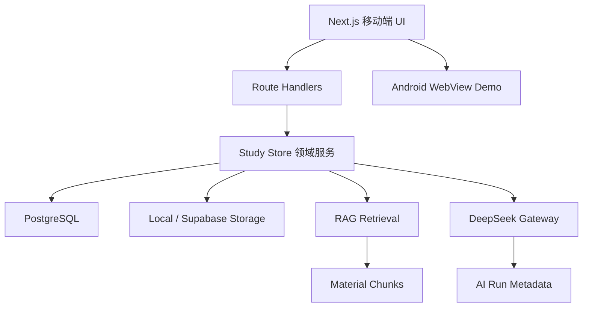

# 药考速记作品集架构说明

## 1. 产品问题

执业药师备考资料分散在讲义、错题、法规笔记和录音中。传统闪卡工具要求用户手工制卡，成本高；直接让大模型总结又容易产生不可追溯、过长或一次考多个点的内容。

本项目选择的核心链路是：

```text
个人资料 -> 可追溯知识片段 -> 高质量单点卡片 -> 复习行为 -> 薄弱点再检索
```

## 2. 系统边界



前端不持有模型密钥。所有 AI 请求都经过服务端，便于限额、记录失败原因和替换模型。

## 3. 资料与 RAG 链路

1. 文件上传后保存原始文件引用。
2. 服务端根据格式提取文本。
3. 文本按段落和长度拆分为 `material_chunks`。
4. 每个分块保留页码、字符区间、标题和哈希。
5. 检索时计算查询词与分块的命中、覆盖和位置得分。
6. 召回结果写入 `rag_retrieval_logs`，区分召回片段和最终使用片段。
7. 卡片通过 `sourceChunkIds`、`sourceRefs`、`sourceSpans` 回溯原文。

RAG v1 没有为了“看起来高级”直接引入复杂向量基础设施，而是先使用可解释、可调试的关键词混合召回。数据结构已经预留 `embedding_chunks`，后续可增加语义召回并与关键词分数融合。

## 4. AI 出卡

模型任务采用低温度 JSON 输出，卡片结构包含：

- 问题和答案
- 卡片类型
- 难度
- 质量分
- 来源引用
- 标签

系统 Prompt 约束“一张卡只考一个点”，优先覆盖作用机制、适应证、禁忌证、不良反应、相互作用、特殊人群和药事法规。

失败策略：

- 模型未配置：本地规则兜底
- JSON 非法：提取 JSON 主体后再次解析
- 超时或供应商失败：记录元数据并生成兜底卡
- Demo 达到每日限额：停止模型请求，继续保证流程可演示
- 输出数量不足：按索引合并模型结果和兜底结果

## 5. 复习与反馈语义

复习结果和内容质量被明确分开：

- `记住 / 模糊 / 忘记`：反映记忆状态，影响复习排期
- `标记`：表示卡片可能不准确，进入待校正列表
- `收藏`：表示用户主观重点，不代表记忆薄弱

这样避免了把“不准确的卡”再次推荐给用户背诵。

## 6. 数据模型

主要实体：

- `users`
- `materials`
- `material_chunks`
- `knowledge_points`
- `cards`
- `review_schedules`
- `review_logs`
- `ai_probes`
- `knowledge_nodes`
- `embedding_chunks`
- `prompt_versions`
- `ai_runs`
- `rag_retrieval_logs`

正式版本需要把当前固定 Demo 用户升级为真实鉴权上下文，并在所有查询中强制加入 `userId` 租户条件。

## 7. 文件存储

`object-storage.ts` 提供统一接口：

- 本地开发：写入 `uploads/`
- Netlify：写入 Supabase 私有 Storage Bucket

数据库只保存文件引用。读取资料时由服务端使用 Service Role 获取文件，浏览器永远拿不到 Service Role Key。

## 8. Demo 成本与安全

作品集环境通过环境变量控制：

- 单文件上传上限
- 每日 AI 请求上限
- 单次最大出卡数
- 数据库连接池大小

公开状态接口不暴露连接串、密钥、文件路径和用户资料。

## 9. 从作品集到正式产品

如果进入真实开发，优先补齐：

1. Supabase Auth 或独立账号系统
2. Row Level Security 与多租户隔离
3. 上传直传与异步解析队列
4. 向量召回和离线评测集
5. 幂等任务、重试与死信队列
6. 数据导出、删除和保留策略
7. 监控、告警、备份和成本预算

作品集版本不伪装成生产系统，而是把这些演进边界明确写出来。
